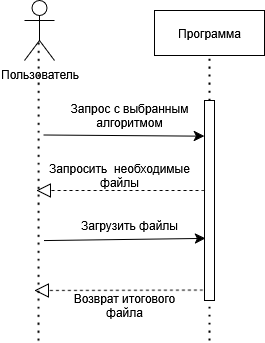

# Audio Steganography - LSB Method

## Описание проекта

Программа для стеганографического встраивания информации в аудиофайлы 
с использованием метода LSB (Least Significant Bit). Позволяет скрывать 
текстовые сообщения в WAV-файлах без заметного изменения звука.

### Модули системы

### класс AudiooooSteganography
**Назначение**: Основной модуль LSB-стеганографии
**Функции**:
- Кодирование текста в аудио (encode_audio)
- Декодирование текста из аудио (decode_audio) 
- Преобразование текст↔бинарный формат (text_to_binary и binary_to_text)
- Расчет емкости аудиофайла и получение других данных о нем (calculate_capacity)

### main.py  
**Назначение**: Точка входа в программу
**Функции**:
- Запуск интерфейса командной строки
- Обработка пользовательского ввода

### UML диаграммы

